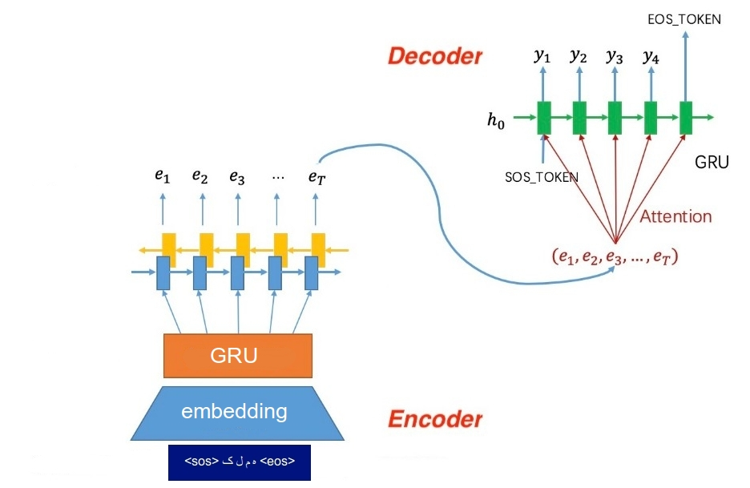

# Attention Based Grapheme To Phoneme
The G2P algorithm is used to generate the most probable pronunciation for a word not contained in the lexicon dictionary.
It could be used as [a preprocess of text-to-speech system](https://github.com/tihu-nlp/tihu/wiki/G2P) to generate pronunciation for OOV words.


## Dependencies
The following libraries are used:<br/>
pytorch<br/>
tqdm<br/>
matplotlib<br/>

Install dependencies using pip:
```
pip3 install -r requirements.txt
```


## Dataset
I clean and prune [zaya dictionary](https://www.peykaregan.ir/dataset/%D9%88%D8%A7%DA%98%DA%AF%D8%A7%D9%86-%D8%B2%D8%A7%DB%8C%D8%A7%DB%8C-%D8%B2%D8%A8%D8%A7%D9%86-%D9%81%D8%A7%D8%B1%D8%B3%DB%8C). The cleaned version is stored in ```resources/Lexicon.json```, and will be used to train the G2P model.
Also there is [tihu dictionary](https://github.com/tihu-nlp/tihudict) which has limited words and could be added to the training lexicon.
Check ```resources``` for more information.

The model could be used for other languages by providing ```Grapheme.json```, ```Phonemes.json``` and ```Lexicon.json```.


## Attention Model
Both encoder-decoder seq2seq model and attention model could handle G2P problem.
Here we train attention based model.

The encoder model get sequence of graphemes and produces states at each timestep.
Encoder states used during attention decoding.
The decoder attends to appropriate encoder state (according to its state) and produces phonemes.


### Train
To start training the model run:
```
python train.py
```
You can also use tensorboard to check the training loss:
```
tensorboard --logdir log --bind_all
```
Training parameters could be found at ```config.py```.

### Test
To get pronunciation of a word:
```
python test.py --word پایتون
p.A.y.t.o.n.<eos>
```
You could also visualize the attention weights, using ```--visualize```:
```
python test.py --visualize --word پایتون
p.A.y.t.o.n.<eos>
```


## Other implementations
Also check [Persian_G2P](https://github.com/AzamRabiee/Persian_G2P), for encoder-decoder seq2seq model implementation.


## TODO
Add beam search decoding.<br/>
Develop PER evaluate script.<br/>
Add encoder-decoder model.<br/>
Add text pronunciation (using hazm for kasre ezafe construction).<br/>
